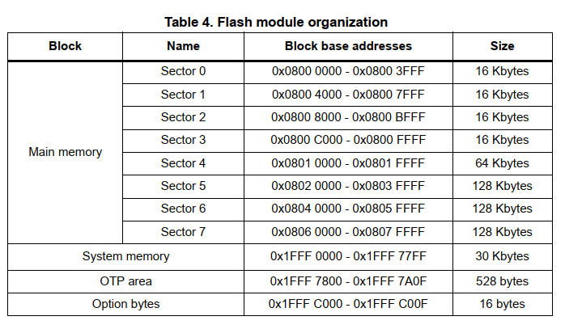
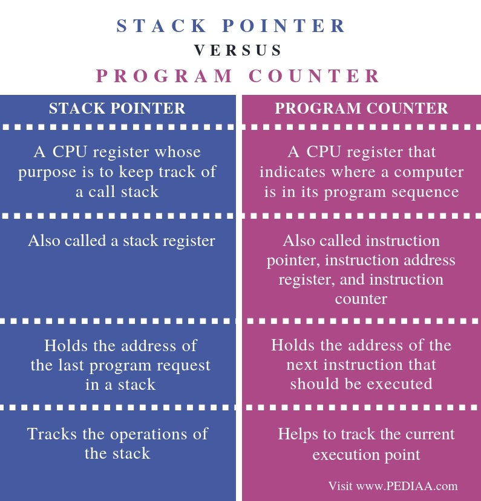

# Bootloader-Development-for-ARM-Cortex-Mx-based-STM32Fx-Microcontroller

What's a bootloader and why its needed?
A: Bootloader is nothing but a small piece of code stored in the MCU flash or ROM to act as an application loader as well as a mechanism to update the applications whenever required.

The main use of bootloader is to download/upload binaries for all 3 boards you mention in this video. But since the ST nucleo board and the TI board have on-board debugger so it is not necessary to use the bootloader to download/upload binaries.
For example, Arduino Uno uses bootloader whenever we want to flash a program into the memory. Upon reset, Arduino bootloader runs first.

If you have a custom board there are some options to update (reprogram) the application running in the microcontroller but in order to do that you need to purchase a JTAG cable, an ICSP or any other tool that in some cases they are expensive.

If you have a (custom) bootloader you have the advantage of avoid using a cable (JTAG, ICSP, etc) to update the application running in the microcontroller. As you could create a customized bootloader you have the flexibility of choice the way the bootloader will work, for example by using a SD card, via OTA, via Ethernet, via Xmodem, Ymodem, Zmodem, etc... A bootloader is very useful when the final product is in the field and an update is needed.

All the ST MCUs store Bootloader in ROM (Read only Memory) a.k.a System Memory. By default MCU will not execute any code from this memory but you can configure MCU to boot or execute bootloader from this memory.

Assuming single block of memory, the FLASH memory's re-writable capability can be achieved only when the flash is completely erased and then it can be reprogrammed again. Doing so, will erase the complete data inside it.

Lets say you need to store some important information and it has to be retained in the flash (for eg., a piece of code for bootloader, which is responsible for the multiple programming of the MCU), if that itself gets erased on the next reprogramming then there is no use of it.

In-order to avoid this, the flash memory is splitted into different sectors and each sectors can be erased independently without affecting the data in the other sectors. So you may store your bootloader in first one or two sectors and other sectors for you user application.

Boot Configuration of STM32F446xx MCU. There are 2 pins associated with BOOT1 and BOOT0. 0 means that the respective pin is grounded, 1 means the pin is pulled to high. If you configure BOOT1=0 and BOOT0 = 1 during reset, System memory will be selected and code inside of this memory region will be executed after rester. 

