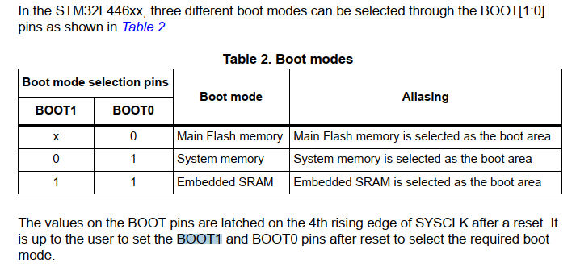
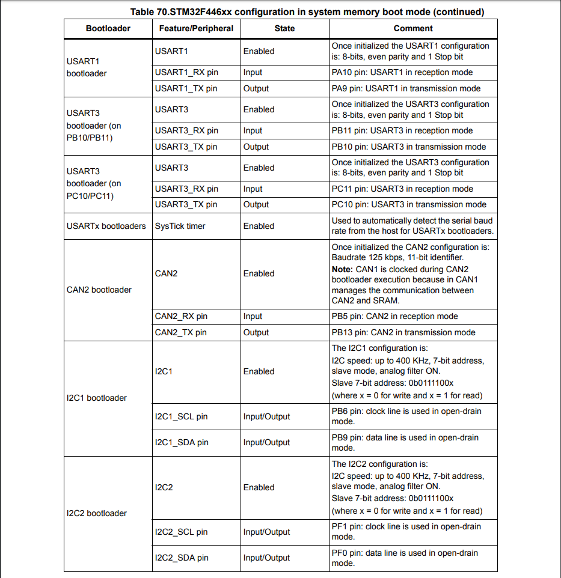
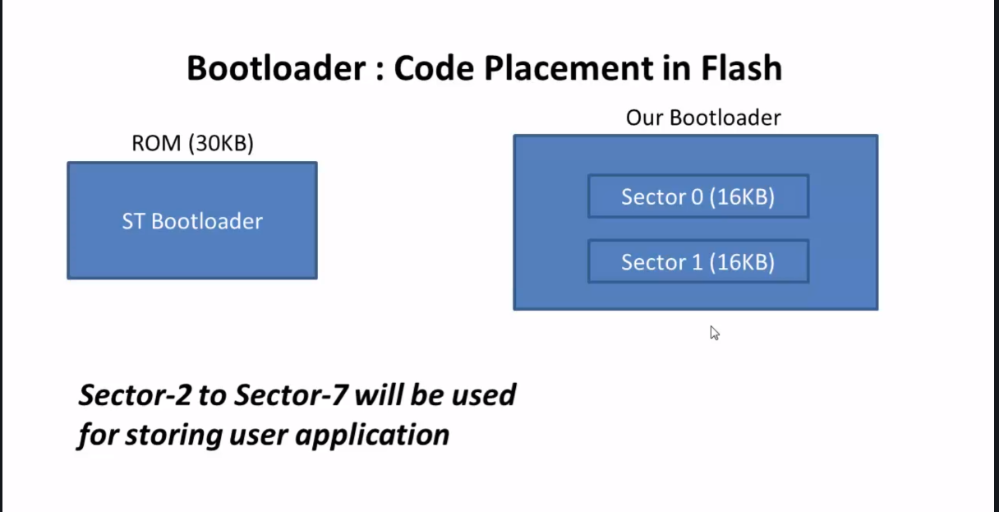
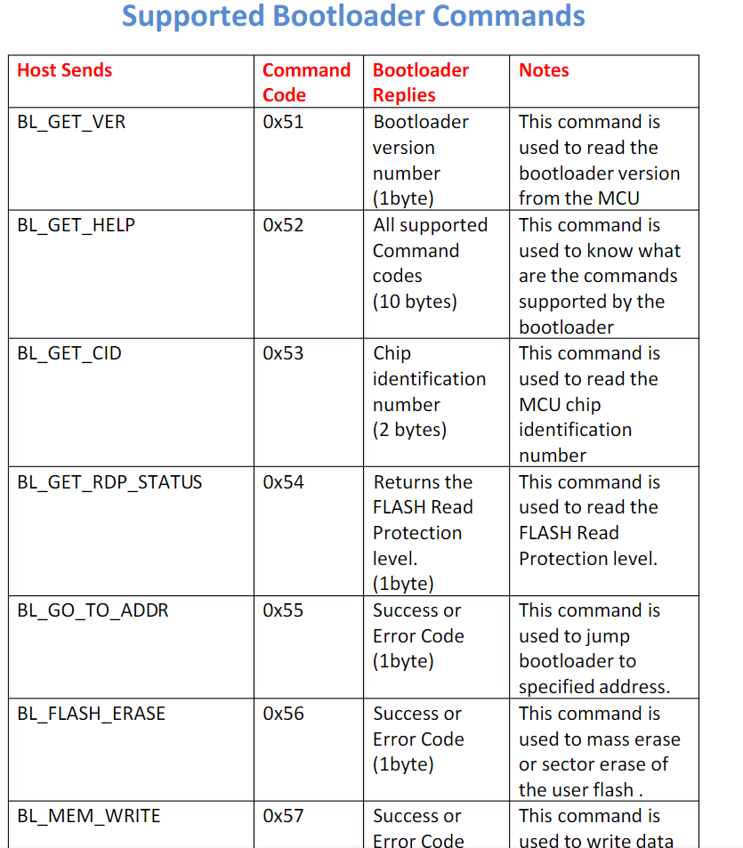
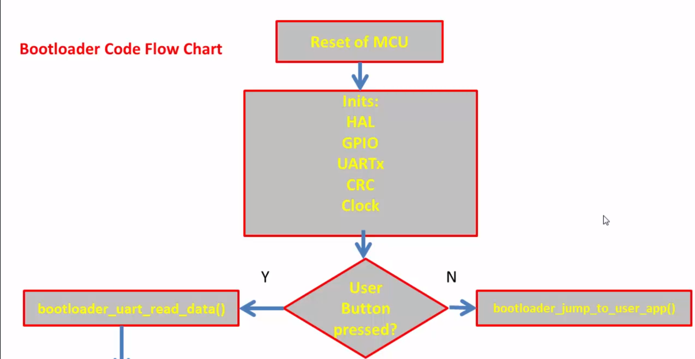
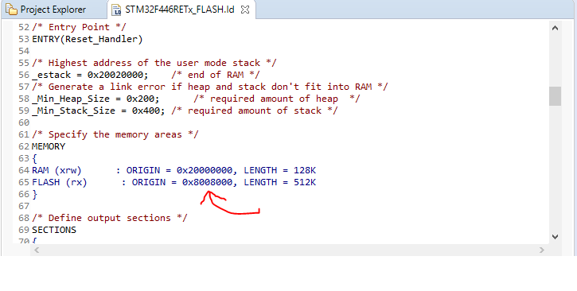
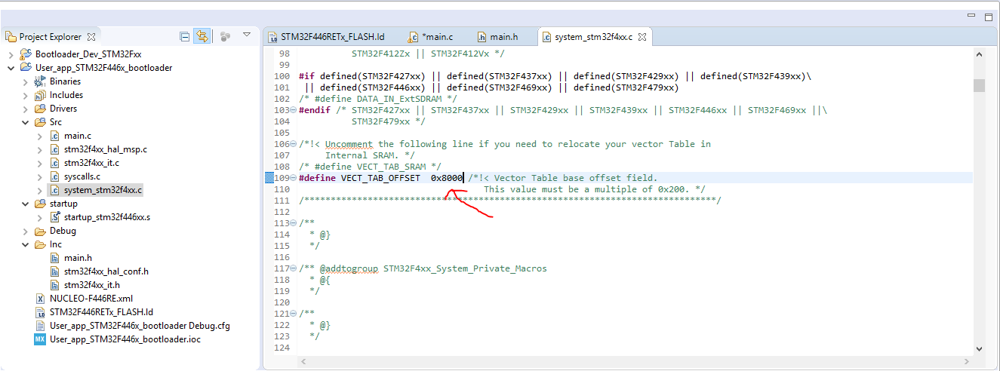

# Bootloader-Development-for-ARM-Cortex-Mx-based-STM32Fx-Microcontroller

What's a bootloader and why its needed?
A: Bootloader is nothing but a small piece of code stored in the MCU flash or ROM to act as an application loader as well as a mechanism to update the applications whenever required.

The main use of bootloader is to download/upload binaries for all 3 boards you mention in this video. But since the ST nucleo board and the TI board have on-board debugger so it is not necessary to use the bootloader to download/upload binaries.
For example, Arduino Uno uses bootloader whenever we want to flash a program into the memory. Upon reset, Arduino bootloader runs first.

If you have a custom board there are some options to update (reprogram) the application running in the microcontroller but in order to do that you need to purchase a JTAG cable, an ICSP or any other tool that in some cases they are expensive.

If you have a (custom) bootloader you have the advantage of avoid using a cable (JTAG, ICSP, etc) to update the application running in the microcontroller. As you could create a customized bootloader you have the flexibility of choice the way the bootloader will work, for example by using a SD card, via OTA, via Ethernet, via Xmodem, Ymodem, Zmodem, etc... A bootloader is very useful when the final product is in the field and an update is needed.

All the ST MCUs store Bootloader in ROM (Read only Memory) a.k.a System Memory. By default MCU will not execute any code from this memory but you can configure MCU to boot or execute bootloader from this memory.

Assuming single block of memory, the FLASH memory's re-writable capability can be achieved only when the flash is completely erased and then it can be reprogrammed again. Doing so, will erase the complete data inside it.

Lets say you need to store some important information and it has to be retained in the flash (for eg., a piece of code for bootloader, which is responsible for the multiple programming of the MCU), if that itself gets erased on the next reprogramming then there is no use of it.

In-order to avoid this, the flash memory is splitted into different sectors and each sectors can be erased independently without affecting the data in the other sectors. So you may store your bootloader in first one or two sectors and other sectors for you user application.

Boot Configuration of STM32F446xx MCU. There are 2 pins associated with BOOT1 and BOOT0. 0 means that the respective pin is grounded, 1 means the pin is pulled to high. If you configure BOOT1=0 and BOOT0 = 1 during reset, System memory will be selected and code inside of this memory region will be executed after rester. 

This table shows which are the peripherals that can be used by the bootloader to communicate with the host.

In this project, we will place our bootloader in the flash memory, more exactly in the Sector 0 and Sector 1. Note that the ST guys already placed their bootloader in the ROM memory and we can't remove it or overwrite it.

There are some of the commands that you can use during bootloader development.

Our project consist of two projects. If the button is pressed during reset, the execution will jump to the bootloader mode. When it's not pressed, the user application will be executed (which is nothing but a simple button-led toggling using interrupt).

NOTE! The user application was created in a different project! The linker script of this project was modified so that this user application was actually loaded into the MCU starting from Sector 2 onward. This is because Sector 1 and 2 will be used for our custom bootloader.

You can see in the image below that the user code was succesfuly loaded starting from the address 0x8008000.

NOTE! There are 2 vector table present in our MCU!. One vector table is from the bootloader starting from 0x0800000 and the other vector table is from the user application starting from 0x08008000. When you flash the code of the user application into the Sector 2 onward, you also need to change the vector table address !. The MCU by default assumes that the vector table starts from the address 0x08000000. But since our user applic. starts from Sector 2, we need to instruct the MCU to take the vector table from 0x08008000. 
So basically you need to tell the user application to not use the vector table from the default location which is now in our case used by the bootloader! 

To solve this issue , there is a register called VTOR (vector table relocation register). In this register, you have to write 0x08008000.

It's not necesarry to hard-code the base address into the VTOR. We can just change this define here.

